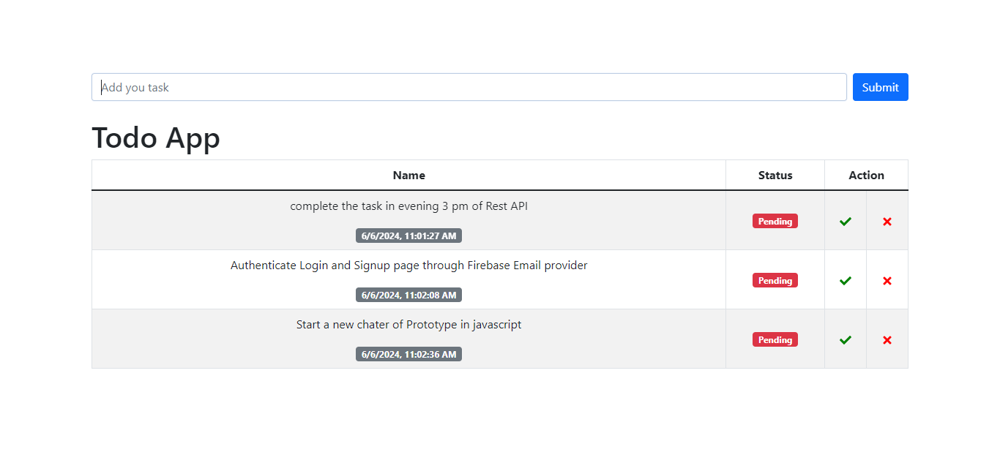

# Todo App

This is a simple Todo App built with React and Redux, using Redux Toolkit for state management and React-Bootstrap for styling. You can add, remove, and update the status of your todo items. 

[Live Demo](https://todo-assignment-kappa.vercel.app/)

## Features

- Add new todo items
- Mark todo items as done
- Remove todo items
- Responsive and user-friendly interface

## Screenshots



## Installation

To get started with the project, follow these steps:

1. **Clone the repository:**
    ```bash
    git clone https://github.com/your-username/todo-app.git
    cd todo-app
    ```

2. **Install dependencies:**
    ```bash
    npm install
    ```

3. **Start the development server:**
    ```bash
    npm start
    ```

## Folder Structure

- `src/`
    - `App.js` - The main component that renders the todo app.
    - `FormAdd.js` - Component for adding new todos.
    - `TodoItem.js` - Component for displaying each todo item.
  - `redux/`
    - `slice/`
      - `todo.js` - Contains the todo slice with reducers for adding, removing, and updating todos.
    - `store.js` - Configures the Redux store.
  - `index.js` - Entry point of the application.

## Setting Up Redux

To set up Redux in this project:

1. **Create a slice:** This slice will handle the state and actions for your todos. It includes actions to add, remove, and update the status of todo items.

2. **Configure the store:** Create a store that combines your slices. This store will manage the global state of your application.

3. **Provide the store:** In your `index.js` file, wrap your app with the `Provider` component from `react-redux` and pass the store to it. This makes the Redux store available to your entire app.

## Components

- **App.js:** The main component that renders the entire todo app, including the form to add todos and the list of todo items.
- **FormAdd.js:** A form component that allows users to add new todo items. It handles the form submission and dispatches the action to add a new todo.
- **TodoItem.js:** A component that displays individual todo items. It includes buttons to mark todos as done and to remove them.

## Running the App

Once you have cloned the repository and installed the dependencies, you can start the development server. This will open the app in your default web browser, and you can start adding, removing, and updating todo items.

## Contributing

Feel free to submit issues or pull requests if you have any improvements or bug fixes.

## License

This project is licensed under the MIT License.
